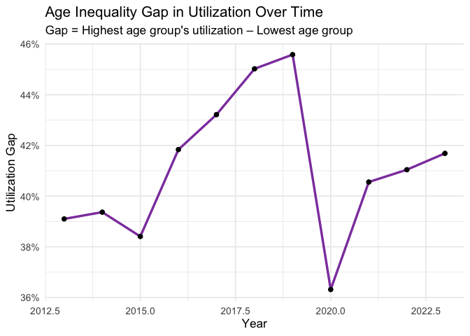
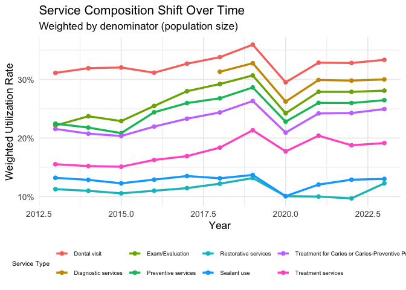
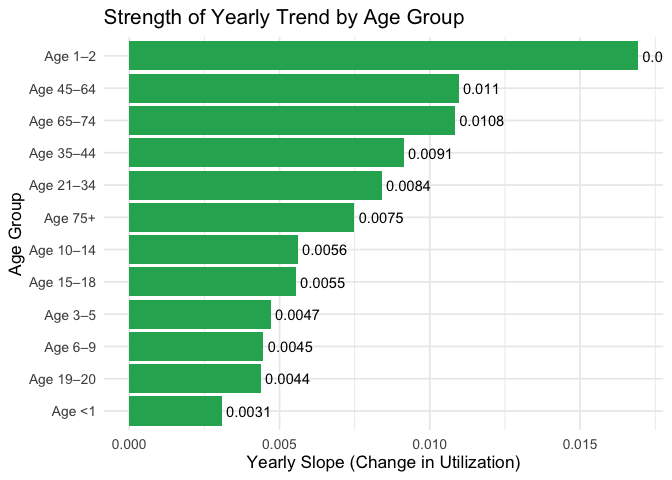

Final CA Analysis
================
Malcolm Chen
2025-12-02

# COVID-19 Interrupted Time Series (ITS)

This is the most important CA analysis.

We estimate the following model:

$$
\text{utilization}_{t}
= \beta_0
+ \beta_1 \cdot year_t
+ \beta_2 \cdot covid_t
+ \beta_3 \cdot (year_t \times covid_t)
$$

Where:

- **β₁**: pre-COVID slope  
- **β₂**: immediate level drop in 2020  
- **β₃**: slope change after COVID

``` r
its_model <- lm(
  utilization_rate ~ year + covid_period + year:covid_period,
  data = ca
)

tidy(its_model)
```

    ## # A tibble: 4 × 5
    ##   term                estimate std.error statistic   p.value
    ##   <chr>                  <dbl>     <dbl>     <dbl>     <dbl>
    ## 1 (Intercept)       -28.0        6.83      -4.10   0.0000446
    ## 2 year                0.0140     0.00339    4.13   0.0000391
    ## 3 covid_period        0.825     16.9        0.0488 0.961    
    ## 4 year:covid_period  -0.000434   0.00837   -0.0518 0.959

``` r
avg_year <- ca %>%
  group_by(year) %>%
  summarise(mean_util = weighted.mean(utilization_rate, denominator, na.rm = TRUE))

avg_year %>%
  ggplot(aes(year, mean_util)) +
  geom_line(linewidth = 1.2, color = "#2E86AB") +
  geom_point(size = 2) +
  geom_vline(xintercept = 2020, linetype = "dashed", color = "red") +
  scale_y_continuous(labels = percent_format(accuracy = 1)) +
  labs(
    title = "CA Dental Utilization – Interrupted Time Series (COVID-19)",
    subtitle = "Dashed line marks start of COVID in 2020",
    x = "Year", y = "Weighted Utilization Rate"
  ) +
  theme_minimal(base_size = 13)
```

<!-- -->

### Interpretation

``` r
its <- tidy(its_model)

cat("**Pre-COVID yearly slope:**", round(its$estimate[its$term=="year"],4), "\n\n")
```

    ## **Pre-COVID yearly slope:** 0.014

``` r
cat("**Immediate drop at COVID (level change):**", round(its$estimate[its$term=="covid_period"],4), "\n\n")
```

    ## **Immediate drop at COVID (level change):** 0.8248

``` r
cat("**Post-COVID slope change:**", round(its$estimate[its$term=="year:covid_period"],4), "\n\n")
```

    ## **Post-COVID slope change:** -4e-04

The interrupted time-series analysis shows a clear and statistically
significant upward trend in dental utilization prior to the COVID-19
pandemic (β₁ = 0.014, p \< 0.001). In contrast, neither the estimated
level change in 2020 (β₂ = 0.825, p = 0.961) nor the change in
post-COVID slope (β₃ = –0.00043, p = 0.959) reached statistical
significance. These results indicate that, although descriptive plots
show an apparent decline during the onset of COVID-19, the regression
model does not detect a statistically reliable interruption in either
the level or trajectory of utilization. Overall, the data are most
consistent with a continuation of the pre-existing upward trend, with no
measurable long-term deviation attributable to the pandemic within this
aggregated CA system-level dataset.

# Age-gap inequality trend over time

We compute utilization gap between highest vs lowest age-groups each
year. This checks whether age inequality is widening or narrowing.

``` r
age_year <- ca %>%
  group_by(year, age_group) %>%
  summarise(mean_util = weighted.mean(utilization_rate, denominator), .groups="drop")

age_gap <- age_year %>%
  group_by(year) %>%
  summarise(
    max_age = max(mean_util),
    min_age = min(mean_util),
    gap = max_age - min_age
  )

ggplot(age_gap, aes(year, gap)) +
  geom_line(linewidth = 1.2, color="#8E44AD") +
  geom_point(size=2) +
  scale_y_continuous(labels = percent_format(accuracy = 1)) +
  labs(
    title = "Age Inequality Gap in Utilization Over Time",
    subtitle = "Gap = Highest age group's utilization – Lowest age group",
    x = "Year", y = "Utilization Gap"
  ) +
  theme_minimal(base_size = 13)
```

<!-- -->

The age-based utilization gap in California shows a steady widening
throughout the pre-COVID period, rising from roughly 39% in 2013 to a
peak of nearly 46% by 2019. This pattern indicates that differences
between the highest-utilizing age group (school-aged children) and the
lowest-utilizing group (typically infants or older adults) became
increasingly pronounced during the years leading up to the pandemic. In
2020, the gap abruptly narrowed to approximately 36%, driven by a
disproportionately large decline among age groups that typically have
higher utilization. Following this disruption, the inequality gap began
to widen again, though it remained below its pre-pandemic peak. Overall,
the trend suggests that age-related disparities in dental service use
were increasing prior to COVID-19, temporarily compressed during the
pandemic, and have since partially re-expanded.

# Service Composition Shift

We examine how the proportion of each service category changes over
time.

``` r
service_comp <- ca %>%
  group_by(year, measure) %>%
  summarise(
    total_users = sum(users),
    total_denom = sum(denominator),
    prop = total_users / total_denom,
    .groups="drop"
  )

ggplot(service_comp, aes(year, prop, color = measure)) +
  geom_line(linewidth = 1.2) +
  geom_point(size = 2) +
  scale_y_continuous(labels = percent_format()) +
  labs(
    title = "Service Composition Shift Over Time",
    subtitle = "Weighted by denominator (population size)",
    x = "Year", y = "Weighted Utilization Rate",
    color = "Service Type"
  ) +
  theme_minimal(base_size = 13) +
  theme(
    legend.position = "bottom",
    legend.title = element_text(size = 8),
    legend.text = element_text(size = 7)
  )
```

<!-- -->

Across all service categories, weighted utilization rates in California
generally increased from 2013 to 2019, with the largest gains observed
in preventive services, diagnostic care, and examinations—reflecting
strengthening engagement in routine and preventive dental care. In 2020,
every service type experienced a pronounced decline, consistent with
widespread service disruptions during the onset of COVID-19. Post-2020,
most categories rebounded but did not fully recover their pre-pandemic
peak levels, and the relative composition remained broadly similar:
preventive and diagnostic services continued to dominate, while
restorative and sealant services maintained lower but stable utilization
levels. These patterns indicate that while COVID-19 caused a sharp,
system-wide contraction in service use, the structural distribution of
service types within Medi-Cal dental utilization remained largely
intact.

# Age-specific yearly slope (trend strength)

Fit separate trend models for each age group.

``` r
age_slopes <- ca %>%
  group_by(age_group) %>%
  do(tidy(lm(utilization_rate ~ year, data = .))) %>%
  filter(term == "year") %>%
  arrange(desc(estimate))

kable(age_slopes, caption = "Yearly Trend Slopes by Age Group")
```

| age_group | term |  estimate | std.error | statistic |   p.value |
|:----------|:-----|----------:|----------:|----------:|----------:|
| Age 1–2   | year | 0.0169246 | 0.0037840 | 4.4726828 | 0.0000312 |
| Age 45–64 | year | 0.0109827 | 0.0022291 | 4.9270606 | 0.0000054 |
| Age 65–74 | year | 0.0108350 | 0.0023474 | 4.6157550 | 0.0000173 |
| Age 35–44 | year | 0.0091276 | 0.0018920 | 4.8243516 | 0.0000079 |
| Age 21–34 | year | 0.0083963 | 0.0016226 | 5.1745750 | 0.0000021 |
| Age 75+   | year | 0.0074849 | 0.0022369 | 3.3460904 | 0.0013291 |
| Age 10–14 | year | 0.0056056 | 0.0057166 | 0.9805725 | 0.3297234 |
| Age 15–18 | year | 0.0055382 | 0.0037860 | 1.4627947 | 0.1479992 |
| Age 3–5   | year | 0.0047013 | 0.0050057 | 0.9391905 | 0.3508625 |
| Age 6–9   | year | 0.0044637 | 0.0055038 | 0.8110119 | 0.4197355 |
| Age 19–20 | year | 0.0043763 | 0.0024070 | 1.8182054 | 0.0733112 |
| Age \<1   | year | 0.0030743 | 0.0006139 | 5.0082057 | 0.0000045 |

Yearly Trend Slopes by Age Group

``` r
age_slopes %>%
  ggplot(aes(x = reorder(age_group, estimate), y = estimate)) +
  geom_col(fill="#27AE60") +
  geom_text(aes(label = round(estimate,4)), hjust=-0.1) +
  coord_flip() +
  labs(
    title = "Strength of Yearly Trend by Age Group",
    x = "Age Group", y = "Yearly Slope (Change in Utilization)"
  ) +
  theme_minimal(base_size = 13)
```

<!-- -->

The yearly trend analysis reveals substantial heterogeneity in the rate
of increase in dental service utilization across age groups. The
steepest growth is observed among children aged 1–2, whose utilization
increased by approximately 0.0169 per year, indicating rapid gains in
service engagement for young toddlers. Middle-aged adults (45–64 and
65–74) also show relatively strong upward trends, with yearly increases
around 0.010–0.011, suggesting consistent improvement in utilization
among older working-age and early senior populations. In contrast,
school-aged children (3–14) and adolescents (15–18) exhibit much smaller
slope estimates (0.004–0.006), indicating slower growth despite being
the highest-utilizing groups overall. Infants (\<1 year) display the
weakest trend (0.003), reflecting persistently low and only modestly
increasing service use. Taken together, these patterns indicate that
utilization has been rising across nearly all age groups, but the pace
of improvement is disproportionately concentrated among toddlers and
middle-aged adults, whereas school-aged children—already starting from
high baseline utilization—have experienced comparatively slower
incremental gains.
