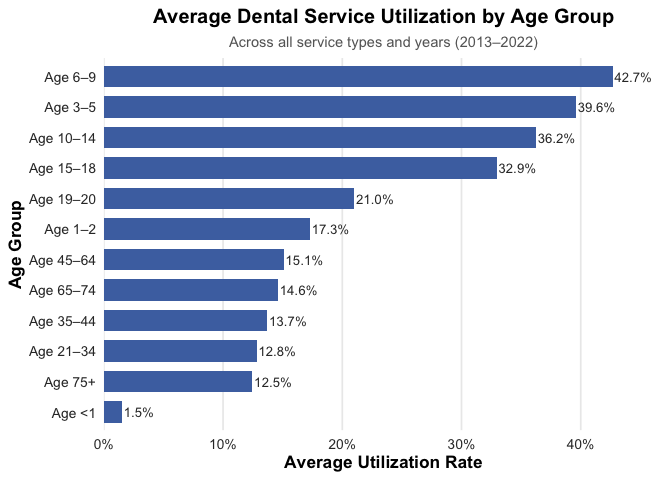
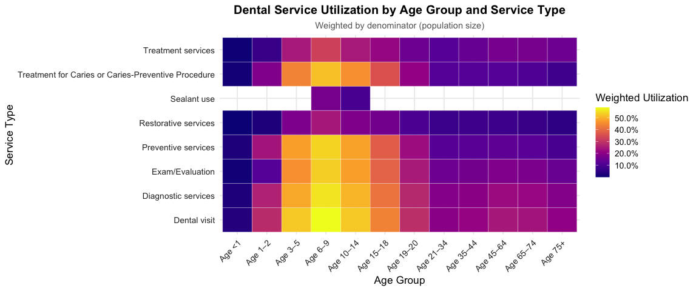
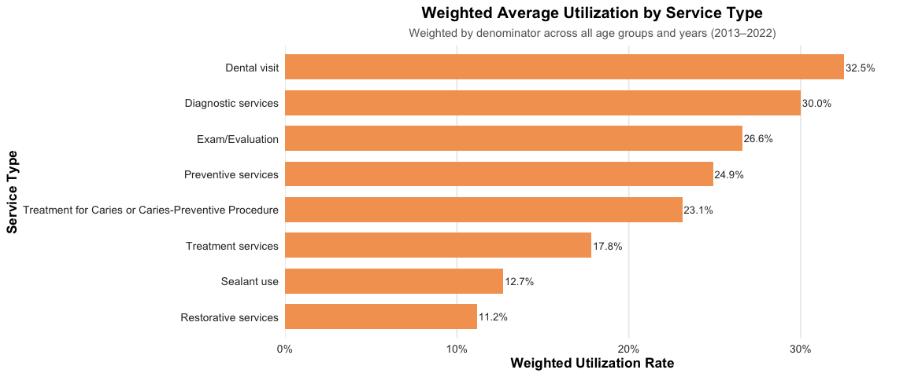

CA_Horizontal
================
2025-11-06

# 年龄组比较

## 下面这个code trunk是错误的

``` r
# 按年龄组计算平均利用率
age_summary <- ca %>%
  group_by(age_group) %>%
  summarise(mean_util = mean(utilization_rate, na.rm = TRUE)) %>%
  arrange(desc(mean_util))

kable(age_summary)
```

| age_group | mean_util |
|:----------|----------:|
| Age 6–9   | 0.4266590 |
| Age 3–5   | 0.3959167 |
| Age 10–14 | 0.3623735 |
| Age 15–18 | 0.3294875 |
| Age 19–20 | 0.2100861 |
| Age 1–2   | 0.1727809 |
| Age 45–64 | 0.1508542 |
| Age 65–74 | 0.1460694 |
| Age 35–44 | 0.1370944 |
| Age 21–34 | 0.1280444 |
| Age 75+   | 0.1246000 |
| Age \<1   | 0.0154194 |

``` r
# 输出最高与最低的年龄组
age_summary %>% slice_head(n = 1)
```

    ## # A tibble: 1 × 2
    ##   age_group mean_util
    ##   <fct>         <dbl>
    ## 1 Age 6–9       0.427

``` r
age_summary %>% slice_tail(n = 1)
```

    ## # A tibble: 1 × 2
    ##   age_group mean_util
    ##   <fct>         <dbl>
    ## 1 Age <1       0.0154

``` r
age_summary %>%
  ggplot(aes(x = reorder(age_group, mean_util), y = mean_util)) +
  geom_col(fill = "#4C72B0", width = 0.7) +                           # 柔和蓝色 + 稍窄柱宽
  geom_text(aes(label = percent(mean_util, accuracy = 0.1)),          # 在柱子右侧显示百分比
            hjust = -0.05, size = 3.5, color = "gray20") +
  coord_flip() +
  scale_y_continuous(labels = percent_format(accuracy = 1), 
                     expand = expansion(mult = c(0, 0.1))) +          # 留一点右边距
  labs(
    title = "Average Dental Service Utilization by Age Group",
    subtitle = "Across all service types and years (2013–2022)",
    x = "Age Group",
    y = "Average Utilization Rate"
  ) +
  theme_minimal(base_size = 13) +                                     # 简洁主题
  theme(
    plot.title = element_text(face = "bold", size = 15, hjust = 0.5),
    plot.subtitle = element_text(size = 11, hjust = 0.5, color = "gray40"),
    axis.text = element_text(color = "gray20"),
    axis.title = element_text(face = "bold"),
    panel.grid.major.y = element_blank(),                            # 去掉横向网格线
    panel.grid.minor = element_blank()
  )
```

<!-- -->

### —- Weighted mean by age group —-

### 我们认为加权平均更合理，因为每个服务类别的样本人群规模（denominator）差异很大。

### 直接取简单平均会让小样本服务的比例被高估，因此这里采用加权平均，

### 即每个年龄组的总使用人数 / 总符合条件人数。

``` r
age_summary_weighted <- ca %>%
  group_by(age_group) %>%
  summarise(
    total_users = sum(users, na.rm = TRUE),
    total_denom = sum(denominator, na.rm = TRUE),
    weighted_util = total_users / total_denom
  ) %>%
  arrange(desc(weighted_util))


# 查看结果表
kable(age_summary_weighted)
```

| age_group | total_users | total_denom | weighted_util |
|:----------|------------:|------------:|--------------:|
| Age 6–9   |    40582322 |    95145614 |     0.4265286 |
| Age 3–5   |    23744880 |    60055501 |     0.3953823 |
| Age 10–14 |    42226240 |   116131801 |     0.3636062 |
| Age 15–18 |    25440852 |    76874410 |     0.3309405 |
| Age 19–20 |     7168455 |    33929864 |     0.2112727 |
| Age 1–2   |     6097515 |    36316061 |     0.1679013 |
| Age 45–64 |    25894840 |   163704702 |     0.1581802 |
| Age 65–74 |     7832363 |    51298149 |     0.1526832 |
| Age 35–44 |    12483435 |    86622304 |     0.1441134 |
| Age 21–34 |    25108100 |   186778161 |     0.1344274 |
| Age 75+   |     5130129 |    40423363 |     0.1269100 |
| Age \<1   |      208771 |    14611638 |     0.0142880 |

``` r
# 绘制图表 -------------------------------------------------------
library(scales)

age_summary_weighted %>%
  ggplot(aes(x = reorder(age_group, weighted_util), y = weighted_util)) +
  geom_col(fill = "#4C72B0", width = 0.7) +
  geom_text(aes(label = percent(weighted_util, accuracy = 0.1)),
            hjust = -0.05, size = 3.5, color = "gray20") +
  coord_flip() +
  scale_y_continuous(labels = percent_format(accuracy = 1),
                     expand = expansion(mult = c(0, 0.1))) +
  labs(
    title = "Weighted Average Dental Service Utilization by Age Group",
    subtitle = "Weighted by denominator (population size) across all service types, 2013–2022",
    x = "Age Group",
    y = "Weighted Utilization Rate"
  ) +
  theme_minimal(base_size = 13) +
  theme(
    plot.title = element_text(face = "bold", size = 15, hjust = 0.5),
    plot.subtitle = element_text(size = 11, hjust = 0.5, color = "gray40"),
    axis.text = element_text(color = "gray20"),
    axis.title = element_text(face = "bold"),
    panel.grid.major.y = element_blank(),
    panel.grid.minor = element_blank()
  )
```

<!-- -->
在对各服务类型按样本人群规模（denominator）进行加权后，年龄组的利用率总体趋势与未加权结果一致，但加权结果更能准确反映总体口腔服务使用水平。
6–9岁儿童的加权利用率最高（约42.7%），其次为3–5岁（39.5%）和10–14岁（36.4%），青少年组（15–18岁）也保持较高水平（33.1%）。
成人与老年组的利用率明显下降，45岁以上人群普遍低于20%，而1岁以下婴儿的利用率最低（约1.4%）。
与未加权结果相比，加权分析对样本量较小的年龄层（如婴幼儿组）进行了修正，使结果更能代表各年龄段总体人群的真实使用水平。
整体结果表明，学龄期儿童（6–14岁）是口腔服务利用最活跃的人群，这可能与学校牙科保健项目有关；而老年群体的口腔服务利用率显著偏低，提示潜在的服务不足问题。

# 服务类型比较

``` r
# ---- Service Type Comparison ----
# 目标：比较不同服务类型（measure）之间的平均利用率
# 我们这里不分年龄组或年份，计算各服务类别的平均利用率
# 同样可以考虑用加权平均，让样本量大的服务权重更高

measure_summary_weighted <- ca %>%
  group_by(measure) %>%
  summarise(
    total_users = sum(users, na.rm = TRUE),
    total_denom = sum(denominator, na.rm = TRUE),
    weighted_util = total_users / total_denom
  ) %>%
  arrange(desc(weighted_util))

# 查看结果表
kable(measure_summary_weighted)
```

| measure | total_users | total_denom | weighted_util |
|:---|---:|---:|---:|
| Dental visit | 46365680 | 142528460 | 0.3253082 |
| Diagnostic services | 24741672 | 82470159 | 0.3000076 |
| Exam/Evaluation | 37916792 | 142528460 | 0.2660296 |
| Preventive services | 35484508 | 142528460 | 0.2489644 |
| Treatment for Caries or Caries-Preventive Procedure | 32943682 | 142528460 | 0.2311376 |
| Treatment services | 25414311 | 142528460 | 0.1783104 |
| Sealant use | 3553547 | 27992407 | 0.1269468 |
| Restorative services | 15497710 | 138786702 | 0.1116657 |

``` r
# 绘制条形图 ------------------------------------------------------
measure_summary_weighted %>%
  ggplot(aes(x = reorder(measure, weighted_util), y = weighted_util)) +
  geom_col(fill = "#F4A261", width = 0.7) +
  geom_text(aes(label = scales::percent(weighted_util, accuracy = 0.1)),
            hjust = -0.05, size = 3.5, color = "gray20") +
  coord_flip() +
  scale_y_continuous(labels = scales::percent_format(accuracy = 1),
                     expand = expansion(mult = c(0, 0.1))) +
  labs(
    title = "Weighted Average Utilization by Service Type",
    subtitle = "Weighted by denominator across all age groups and years (2013–2022)",
    x = "Service Type",
    y = "Weighted Utilization Rate"
  ) +
  theme_minimal(base_size = 13) +
  theme(
    plot.title = element_text(face = "bold", size = 15, hjust = 0.5),
    plot.subtitle = element_text(size = 11, hjust = 0.5, color = "gray40"),
    axis.text = element_text(color = "gray20"),
    axis.title = element_text(face = "bold"),
    panel.grid.major.y = element_blank(),
    panel.grid.minor = element_blank()
  )
```

<!-- -->

# 年龄x服务交互

``` r
# ---- Age × Service Type Interaction ----
# 目标：探索不同年龄组在不同服务类型下的利用率差异
# 采用加权平均，以避免某些服务类别或年龄层样本过小的偏差

cross_summary_weighted <- ca %>%
  group_by(age_group, measure) %>%
  summarise(
    total_users = sum(users, na.rm = TRUE),
    total_denom = sum(denominator, na.rm = TRUE),
    weighted_util = total_users / total_denom
  )
```

    ## `summarise()` has grouped output by 'age_group'. You can override using the
    ## `.groups` argument.

``` r
cross_summary_weighted <- cross_summary_weighted %>%
  mutate(age_group = factor(age_group, levels = age_order))

# 热图展示 --------------------------------------------------------
cross_summary_weighted %>%
  ggplot(aes(x = age_group, y = measure, fill = weighted_util)) +
  geom_tile(color = "white") +
  scale_fill_viridis_c(option = "C", labels = scales::percent_format(accuracy = 0.1)) +
  labs(
    title = "Dental Service Utilization by Age Group and Service Type",
    subtitle = "Weighted by denominator (population size)",
    x = "Age Group",
    y = "Service Type",
    fill = "Weighted Utilization"
  ) +
  theme_minimal(base_size = 13) +
  theme(
    plot.title = element_text(face = "bold", size = 15, hjust = 0.5),
    plot.subtitle = element_text(size = 11, hjust = 0.5, color = "gray40"),
    axis.text.x = element_text(angle = 45, hjust = 1),
    axis.text = element_text(color = "gray20"),
    legend.position = "right"
  )
```

<!-- -->
