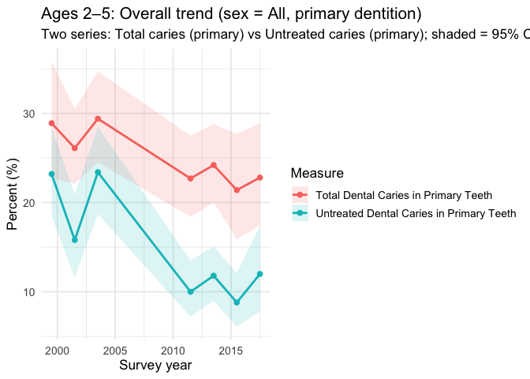
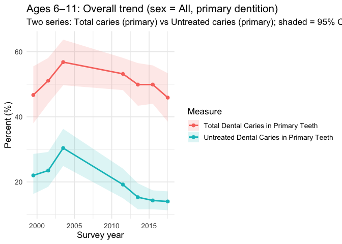
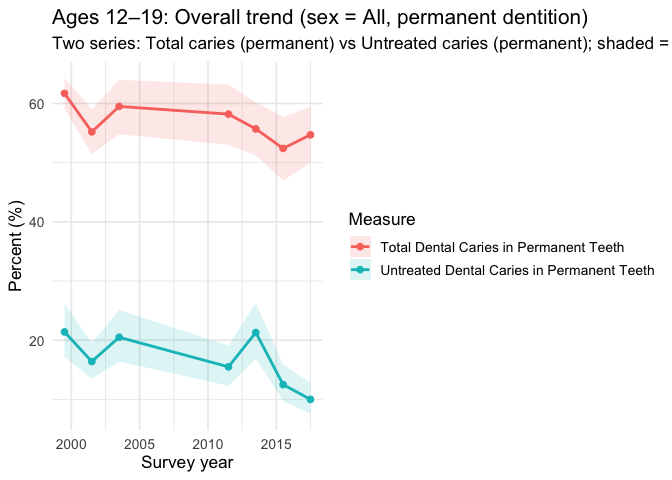
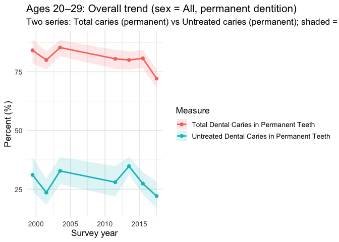
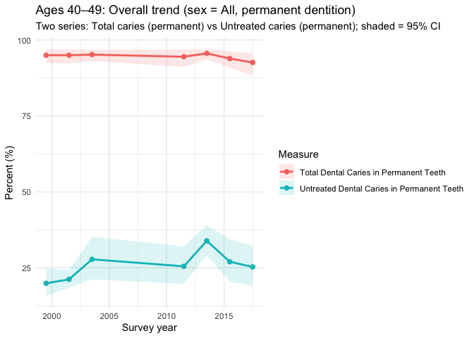
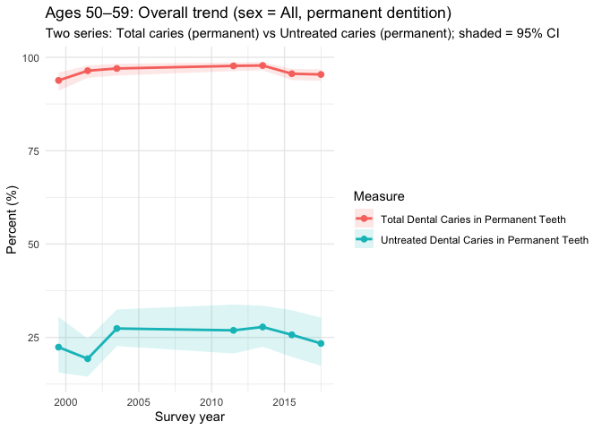
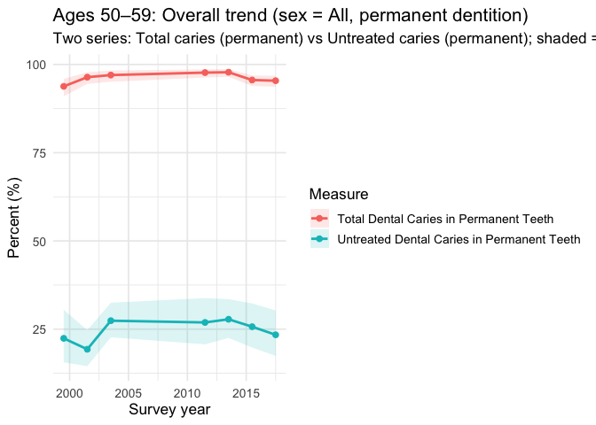
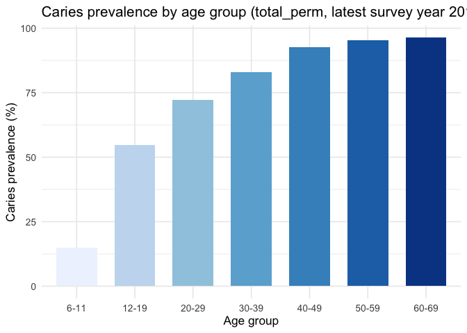
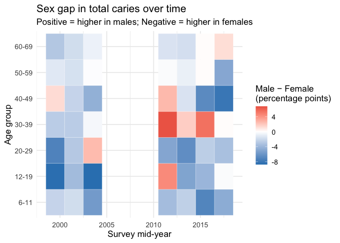
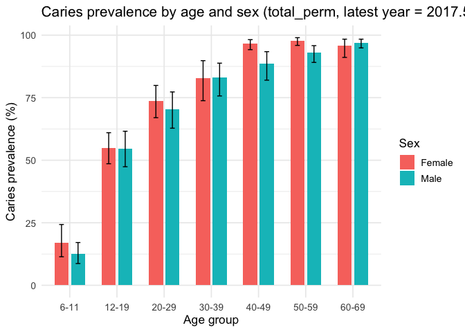

NHANES_Trend Analysis
================
Keyu

``` r
library(tidyverse)
```

    ## ── Attaching core tidyverse packages ──────────────────────── tidyverse 2.0.0 ──
    ## ✔ dplyr     1.1.4     ✔ readr     2.1.5
    ## ✔ forcats   1.0.0     ✔ stringr   1.5.1
    ## ✔ ggplot2   3.5.2     ✔ tibble    3.3.0
    ## ✔ lubridate 1.9.4     ✔ tidyr     1.3.1
    ## ✔ purrr     1.1.0     
    ## ── Conflicts ────────────────────────────────────────── tidyverse_conflicts() ──
    ## ✖ dplyr::filter() masks stats::filter()
    ## ✖ dplyr::lag()    masks stats::lag()
    ## ℹ Use the conflicted package (<http://conflicted.r-lib.org/>) to force all conflicts to become errors

``` r
library(readr)
```

**Load the data**

``` r
nhanes <- read_csv("./datasets/nhanes_oral_clean.csv") %>% 
  janitor::clean_names() %>% 
  mutate(age_group = factor(age_group,
                       levels = c("2-5","6-11","12-19","20-29",
                                  "30-39","40-49","50-59","60-69")))
```

    ## Rows: 438 Columns: 11
    ## ── Column specification ────────────────────────────────────────────────────────
    ## Delimiter: ","
    ## chr (6): survey_years, sex, age_group, race_ethnicity, measure, measure_clean
    ## dbl (5): year_mid, percent, se, ci_lower, ci_upper
    ## 
    ## ℹ Use `spec()` to retrieve the full column specification for this data.
    ## ℹ Specify the column types or set `show_col_types = FALSE` to quiet this message.

**Overall Time Trend by age group:**

``` r
# === Step: Overall trend for ages 2–5 (sex = All, primary dentition) ===
d25 <- nhanes %>%
  filter(
    tolower(sex) == "all",
    age_group %in% c("2-5","2–5","2—5"),
    measure_clean %in% c("total_primary","untreated_primary")
  ) %>%
  mutate(
    measure_label = recode(measure_clean,
                           "total_primary"     = "Total Dental Caries in Primary Teeth",
                           "untreated_primary" = "Untreated Dental Caries in Primary Teeth")
  ) %>%
  arrange(year_mid, measure_clean)

ggplot(d25, aes(x = year_mid, y = percent,
                     color = measure_label, fill = measure_label)) +
  geom_ribbon(aes(ymin = ci_lower, ymax = ci_upper), alpha = 0.15, color = NA) +
  geom_line(size = 1) +
  geom_point(size = 2) +
  scale_x_continuous(breaks = scales::pretty_breaks()) +
  labs(
    title = "Ages 2–5: Overall trend (sex = All, primary dentition)",
    subtitle = "Two series: Total caries (primary) vs Untreated caries (primary); shaded = 95% CI",
    x = "Survey year", y = "Percent (%)", color = "Measure", fill = "Measure"
  ) +
  theme_minimal()
```

    ## Warning: Using `size` aesthetic for lines was deprecated in ggplot2 3.4.0.
    ## ℹ Please use `linewidth` instead.
    ## This warning is displayed once every 8 hours.
    ## Call `lifecycle::last_lifecycle_warnings()` to see where this warning was
    ## generated.

<!-- -->

``` r
# === Step: Overall trend for ages 6–11 (sex = All, primary dentition) ===
d611 <- nhanes %>%
  filter(
    tolower(sex) == "all",
    age_group %in% c("6-11"),
    measure_clean %in% c("total_primary","untreated_primary")
  ) %>%
  mutate(
    measure_label = recode(measure_clean,
                           "total_primary"     = "Total Dental Caries in Primary Teeth",
                           "untreated_primary" = "Untreated Dental Caries in Primary Teeth")
  ) %>%
  arrange(year_mid, measure_clean)

ggplot(d611, aes(x = year_mid, y = percent,
                     color = measure_label, fill = measure_label)) +
  geom_ribbon(aes(ymin = ci_lower, ymax = ci_upper), alpha = 0.15, color = NA) +
  geom_line(size = 1) +
  geom_point(size = 2) +
  scale_x_continuous(breaks = scales::pretty_breaks()) +
  labs(
    title = "Ages 6–11: Overall trend (sex = All, primary dentition)",
    subtitle = "Two series: Total caries (primary) vs Untreated caries (primary); shaded = 95% CI",
    x = "Survey year", y = "Percent (%)", color = "Measure", fill = "Measure"
  ) +
  theme_minimal()
```

<!-- -->

``` r
# === Step: Overall trend for ages 12–19 (sex = All, permanent dentition) ===
d1219 <- nhanes %>%
  filter(
    tolower(sex) == "all",
    age_group %in% c("12-19"),
    measure_clean %in% c("total_perm","untreated_perm")
  ) %>%
  mutate(
    measure_label = recode(measure_clean,
                           "total_perm"     = "Total Dental Caries in Permanent Teeth",
                           "untreated_perm" = "Untreated Dental Caries in Permanent Teeth")
  ) %>%
  arrange(year_mid, measure_clean)

ggplot(d1219, aes(x = year_mid, y = percent,
                     color = measure_label, fill = measure_label)) +
  geom_ribbon(aes(ymin = ci_lower, ymax = ci_upper), alpha = 0.15, color = NA) +
  geom_line(size = 1) +
  geom_point(size = 2) +
  scale_x_continuous(breaks = scales::pretty_breaks()) +
  labs(
    title = "Ages 12–19: Overall trend (sex = All, permanent dentition)",
    subtitle = "Two series: Total caries (permanent) vs Untreated caries (permanent); shaded = 95% CI",
    x = "Survey year", y = "Percent (%)", color = "Measure", fill = "Measure"
  ) +
  theme_minimal()
```

<!-- -->

``` r
# === Step: Overall trend for ages 20–29 (sex = All, permanent dentition) ===
d2029 <- nhanes %>%
  filter(
    tolower(sex) == "all",
    age_group %in% c("20-29"),
    measure_clean %in% c("total_perm","untreated_perm")
  ) %>%
  mutate(
    measure_label = recode(measure_clean,
                           "total_perm"     = "Total Dental Caries in Permanent Teeth",
                           "untreated_perm" = "Untreated Dental Caries in Permanent Teeth")
  ) %>%
  arrange(year_mid, measure_clean)

ggplot(d2029, aes(x = year_mid, y = percent,
                     color = measure_label, fill = measure_label)) +
  geom_ribbon(aes(ymin = ci_lower, ymax = ci_upper), alpha = 0.15, color = NA) +
  geom_line(size = 1) +
  geom_point(size = 2) +
  scale_x_continuous(breaks = scales::pretty_breaks()) +
  labs(
    title = "Ages 20–29: Overall trend (sex = All, permanent dentition)",
    subtitle = "Two series: Total caries (permanent) vs Untreated caries (permanent); shaded = 95% CI",
    x = "Survey year", y = "Percent (%)", color = "Measure", fill = "Measure"
  ) +
  theme_minimal()
```

<!-- -->

``` r
# === Step: Overall trend for ages 30–39 (sex = All, permanent dentition) ===
d3039 <- nhanes %>%
  filter(
    tolower(sex) == "all",
    age_group %in% c("30-39"),
    measure_clean %in% c("total_perm","untreated_perm")
  ) %>%
  mutate(
    measure_label = recode(measure_clean,
                           "total_perm"     = "Total Dental Caries in Permanent Teeth",
                           "untreated_perm" = "Untreated Dental Caries in Permanent Teeth")
  ) %>%
  arrange(year_mid, measure_clean)

ggplot(d3039, aes(x = year_mid, y = percent,
                     color = measure_label, fill = measure_label)) +
  geom_ribbon(aes(ymin = ci_lower, ymax = ci_upper), alpha = 0.15, color = NA) +
  geom_line(size = 1) +
  geom_point(size = 2) +
  scale_x_continuous(breaks = scales::pretty_breaks()) +
  labs(
    title = "Ages 30–39: Overall trend (sex = All, permanent dentition)",
    subtitle = "Two series: Total caries (permanent) vs Untreated caries (permanent); shaded = 95% CI",
    x = "Survey year", y = "Percent (%)", color = "Measure", fill = "Measure"
  ) +
  theme_minimal()
```

<!-- -->

``` r
# === Step: Overall trend for ages 40–49 (sex = All, permanent dentition) ===
d4049 <- nhanes %>%
  filter(
    tolower(sex) == "all",
    age_group %in% c("40-49"),
    measure_clean %in% c("total_perm","untreated_perm")
  ) %>%
  mutate(
    measure_label = recode(measure_clean,
                           "total_perm"     = "Total Dental Caries in Permanent Teeth",
                           "untreated_perm" = "Untreated Dental Caries in Permanent Teeth")
  ) %>%
  arrange(year_mid, measure_clean)

ggplot(d4049, aes(x = year_mid, y = percent,
                     color = measure_label, fill = measure_label)) +
  geom_ribbon(aes(ymin = ci_lower, ymax = ci_upper), alpha = 0.15, color = NA) +
  geom_line(size = 1) +
  geom_point(size = 2) +
  scale_x_continuous(breaks = scales::pretty_breaks()) +
  labs(
    title = "Ages 40–49: Overall trend (sex = All, permanent dentition)",
    subtitle = "Two series: Total caries (permanent) vs Untreated caries (permanent); shaded = 95% CI",
    x = "Survey year", y = "Percent (%)", color = "Measure", fill = "Measure"
  ) +
  theme_minimal()
```

<!-- -->

``` r
# === Step: Overall trend for ages 50–59 (sex = All, permanent dentition) ===
d5059 <- nhanes %>%
  filter(
    tolower(sex) == "all",
    age_group %in% c("50-59"),
    measure_clean %in% c("total_perm","untreated_perm")
  ) %>%
  mutate(
    measure_label = recode(measure_clean,
                           "total_perm"     = "Total Dental Caries in Permanent Teeth",
                           "untreated_perm" = "Untreated Dental Caries in Permanent Teeth")
  ) %>%
  arrange(year_mid, measure_clean)

ggplot(d5059, aes(x = year_mid, y = percent,
                     color = measure_label, fill = measure_label)) +
  geom_ribbon(aes(ymin = ci_lower, ymax = ci_upper), alpha = 0.15, color = NA) +
  geom_line(size = 1) +
  geom_point(size = 2) +
  scale_x_continuous(breaks = scales::pretty_breaks()) +
  labs(
    title = "Ages 50–59: Overall trend (sex = All, permanent dentition)",
    subtitle = "Two series: Total caries (permanent) vs Untreated caries (permanent); shaded = 95% CI",
    x = "Survey year", y = "Percent (%)", color = "Measure", fill = "Measure"
  ) +
  theme_minimal()
```

<!-- -->

``` r
# === Step: Overall trend for ages 60–69 (sex = All, permanent dentition) ===
d6069 <- nhanes %>%
  filter(
    tolower(sex) == "all",
    age_group %in% c("60-69"),
    measure_clean %in% c("total_perm","untreated_perm")
  ) %>%
  mutate(
    measure_label = recode(measure_clean,
                           "total_perm"     = "Total Dental Caries in Permanent Teeth",
                           "untreated_perm" = "Untreated Dental Caries in Permanent Teeth")
  ) %>%
  arrange(year_mid, measure_clean)

ggplot(d6069, aes(x = year_mid, y = percent,
                     color = measure_label, fill = measure_label)) +
  geom_ribbon(aes(ymin = ci_lower, ymax = ci_upper), alpha = 0.15, color = NA) +
  geom_line(size = 1) +
  geom_point(size = 2) +
  scale_x_continuous(breaks = scales::pretty_breaks()) +
  labs(
    title = "Ages 60–69: Overall trend (sex = All, permanent dentition)",
    subtitle = "Two series: Total caries (permanent) vs Untreated caries (permanent); shaded = 95% CI",
    x = "Survey year", y = "Percent (%)", color = "Measure", fill = "Measure"
  ) +
  theme_minimal()
```

<!-- -->

``` r
# 1) choose outcome & dentition, e.g. total_primary (ages 2–11) or total_perm (10+)
target_meas <- "total_perm"  # change to "total_perm" for permanent dentition

base <- nhanes %>%
  filter(
    tolower(race_ethnicity) == "all",
    tolower(sex) %in% c("male","female"),
    measure_clean == target_meas
  ) %>%
  mutate(
    sex = case_when(
      tolower(sex) == "male"   ~ "Male",
      tolower(sex) == "female" ~ "Female",
      TRUE ~ sex
    )
  )

# 2) wide join: Male & Female side by side
male <- base %>%
  filter(sex == "Male") %>%
  select(age_group, year_mid, percent_M = percent)

female <- base %>%
  filter(sex == "Female") %>%
  select(age_group, year_mid, percent_F = percent)

gap <- male %>%
  inner_join(female, by = c("age_group","year_mid")) %>%
  mutate(
    Gap_abs = percent_M - percent_F   # >0: higher in males
  )

# 3) heatmap of sex gap over time & age
p_heat <- ggplot(gap, aes(x = year_mid, y = age_group, fill = Gap_abs)) +
  geom_tile(color = "white") +
  scale_fill_gradient2(
    name = "Male − Female\n(percentage points)",
    low = "#3182bd", mid = "white", high = "#de2d26", midpoint = 0
  ) +
  scale_x_continuous(breaks = scales::pretty_breaks()) +
  labs(
    title = "Sex gap in total caries over time",
    subtitle = "Positive = higher in males; Negative = higher in females",
    x = "Survey mid-year", y = "Age group"
  ) +
  theme_minimal(base_size = 13)

print(p_heat)
```

<!-- -->

``` r
# 2) Choose outcome (you can change this)
target_meas <- "total_perm"        # or "total_primary", "untreated_primary", "untreated_perm"

# 3) Filter to race = All, sex = All, chosen outcome
base <- nhanes %>%
  filter(
    tolower(race_ethnicity) == "all",
    tolower(sex) == "all",
    measure_clean == target_meas
  )

# 4) Choose latest survey mid-year
latest_year <- max(base$year_mid, na.rm = TRUE)

latest <- base %>%
  filter(year_mid == latest_year) %>%
  mutate(
    # unify age group formatting
    age_group = gsub("–|—", "-", age_group),
    age_group = factor(
      age_group,
      levels = c("2-5","6-11","12-19","20-29",
                 "30-39","40-49","50-59","60-69")
    )
  ) %>%
  arrange(age_group)

# 5) Age-group bar chart
p_age_bar <- ggplot(latest, aes(x = age_group, y = percent, fill = age_group)) +
  geom_col(width = 0.7) +
  scale_fill_brewer(palette = "Blues", direction = 1) +
  labs(
    title = sprintf("Caries prevalence by age group (%s, latest survey year %.1f)",
                    target_meas, latest_year),
    x = "Age group",
    y = "Caries prevalence (%)"
  ) +
  theme_minimal(base_size = 13) +
  theme(legend.position = "none")

print(p_age_bar)
```

<!-- -->

``` r
# 3) Filter to race = All, sex = Male/Female, chosen outcome
base <- nhanes %>%
  filter(
    tolower(race_ethnicity) == "all",
    tolower(sex) %in% c("male","female"),
    measure_clean == target_meas
  ) %>%
  mutate(
    sex = case_when(
      tolower(sex) == "male"   ~ "Male",
      tolower(sex) == "female" ~ "Female",
      TRUE ~ sex
    ),
    age_group = gsub("–|—", "-", age_group)  # unify dash
  )

# 4) Use latest survey mid-year
latest_year <- max(base$year_mid, na.rm = TRUE)

latest <- base %>%
  filter(year_mid == latest_year) %>%
  mutate(
    age_group = factor(
      age_group,
      levels = c("2-5","6-11","12-19","20-29",
                 "30-39","40-49","50-59","60-69")
    )
  ) %>%
  arrange(age_group, sex)

# 5) Grouped bar chart: prevalence by age × sex
p_age_sex <- ggplot(latest,
                    aes(x = age_group, y = percent, fill = sex)) +
  geom_col(position = position_dodge(width = 0.7), width = 0.6) +
  # Optional: add 95% CI error bars if you want
  geom_errorbar(aes(ymin = ci_lower, ymax = ci_upper),
                 position = position_dodge(width = 0.7),
                 width = 0.2, linewidth = 0.5) +
  labs(
    title = sprintf("Caries prevalence by age and sex (%s, latest year = %.1f)",
                    target_meas, latest_year),
    x = "Age group",
    y = "Caries prevalence (%)",
    fill = "Sex"
  ) +
  theme_minimal(base_size = 13)

print(p_age_sex)
```

<!-- -->
