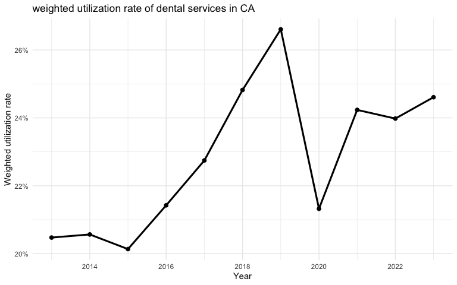
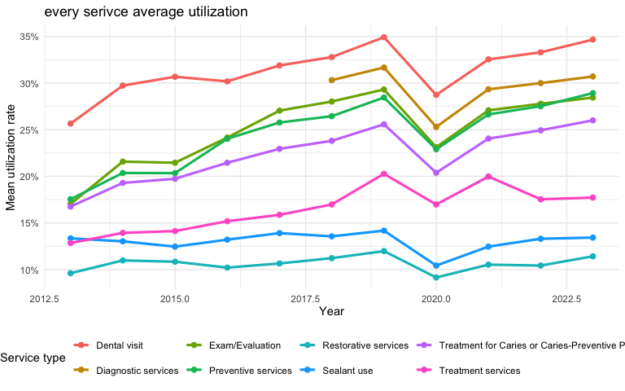
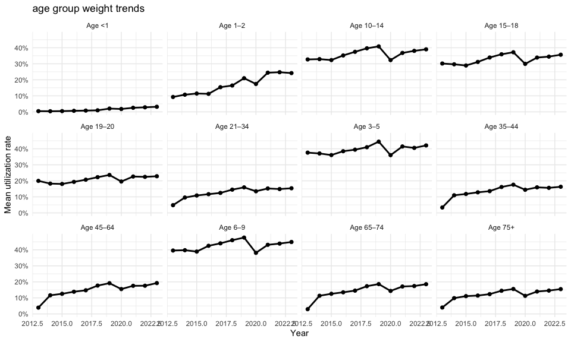

analyst—CA
================
Jason Gao
2025-11-06

## 0. 环境准备 ——————————————————–

``` r
library(tidyverse)
```

    ## ── Attaching core tidyverse packages ──────────────────────── tidyverse 2.0.0 ──
    ## ✔ dplyr     1.1.4     ✔ readr     2.1.5
    ## ✔ forcats   1.0.1     ✔ stringr   1.5.2
    ## ✔ ggplot2   4.0.0     ✔ tibble    3.3.0
    ## ✔ lubridate 1.9.4     ✔ tidyr     1.3.1
    ## ✔ purrr     1.1.0     
    ## ── Conflicts ────────────────────────────────────────── tidyverse_conflicts() ──
    ## ✖ dplyr::filter() masks stats::filter()
    ## ✖ dplyr::lag()    masks stats::lag()
    ## ℹ Use the conflicted package (<http://conflicted.r-lib.org/>) to force all conflicts to become errors

``` r
library(scales)
```

    ## 
    ## Attaching package: 'scales'
    ## 
    ## The following object is masked from 'package:purrr':
    ## 
    ##     discard
    ## 
    ## The following object is masked from 'package:readr':
    ## 
    ##     col_factor

``` r
library(broom)
library(knitr)
## 创建输出目录（如果不存在就建）
if (!dir.exists("output")) dir.create("output")
if (!dir.exists("output/trend_plots")) dir.create("output/trend_plots")
if (!dir.exists("output/trend_tables")) dir.create("output/trend_tables")
```

## 1. 读入并预处理数据 ———————————————–

``` r
# 读入与预处理：把百分比转成 0-1 小数，year 转 int
df_raw <- readr::read_csv("datasets/clean_ca.csv")
```

    ## Rows: 876 Columns: 6
    ## ── Column specification ────────────────────────────────────────────────────────
    ## Delimiter: ","
    ## chr (4): year, age_group, measure, utilization_rate
    ## dbl (2): users, denominator
    ## 
    ## ℹ Use `spec()` to retrieve the full column specification for this data.
    ## ℹ Specify the column types or set `show_col_types = FALSE` to quiet this message.

``` r
df <- df_raw %>%
  mutate(
    year = str_replace(year, "CY\\s*", "") %>% as.integer(),
    utilization_rate = str_replace(utilization_rate, "%", "") %>% as.numeric() / 100,
    users = as.numeric(users),
    denominator = as.numeric(denominator)
  )

# 年度汇总：均值/中位数/总人数/加权总体利用率
year_summary <- df %>%
  group_by(year) %>%
  summarize(
    mean_utilization   = mean(utilization_rate, na.rm = TRUE),
    median_utilization = median(utilization_rate, na.rm = TRUE),
    total_users        = sum(users, na.rm = TRUE),
    total_denominator  = sum(denominator, na.rm = TRUE),
    overall_rate_weighted = sum(utilization_rate * denominator, na.rm = TRUE) /
                            sum(denominator, na.rm = TRUE)
  ) %>% ungroup()

head(year_summary)
```

    ## # A tibble: 6 × 6
    ##    year mean_utilization median_utilization total_users total_denominator
    ##   <int>            <dbl>              <dbl>       <dbl>             <dbl>
    ## 1  2013            0.167              0.107    10801088          52753344
    ## 2  2014            0.194              0.143    14382669          69931976
    ## 3  2015            0.196              0.149    15692865          77937696
    ## 4  2016            0.207              0.158    18345247          85626052
    ## 5  2017            0.221              0.179    19187205          84350551
    ## 6  2018            0.240              0.199    23829529          95997256
    ## # ℹ 1 more variable: overall_rate_weighted <dbl>

``` r
# 一些内嵌需要用到的便捷量
y_min  <- min(year_summary$year, na.rm = TRUE)
y_max  <- max(year_summary$year, na.rm = TRUE)
y_pk   <- year_summary$year[ which.max(year_summary$overall_rate_weighted) ]
val_pk <- max(year_summary$overall_rate_weighted, na.rm = TRUE)
```

## 2. 生成年度总结报告 ————————————————

<!-- -->

- This report analyzes the trends in dental service utilization in
  California from CY 2013 to CY 2023.  
- During this period, the annual weighted overall dental service
  utilization reached its peak in CY 2019, at 26.6%.  
- The lowest annual weighted utilization occurred in CY 2015, at
  20.1%.  
- The average annual weighted utilization rate over the entire period
  was 22.8%, and the median value was 22.7%.  
- The total number of enrolled individuals increased from 52,753,344 in
  CY 2013 to 111,088,145 in CY 2023, representing a growth of 110.6%.

<!-- -->

### Service Type Utilization Trends

The figure below illustrates the mean utilization rate for each service
type from 2013 to 2023.

Among all categories, **Dental visit** has the highest average
utilization, increasing from about 25.6% in 2013 to around 34.9% in
2023.

**Preventive services** and **Exam/Evaluation** also show steady growth,
reaching around 28.9% and 29.3% by 2023.

In contrast, **Restorative services** and **Diagnostic services**
maintain lower utilization, both staying near 10.6% on average.

A noticeable dip in 2020 reflects the disruption during the COVID-19
period, after which utilization levels gradually recovered.

Overall, from 2013 to 2023, most service types demonstrate a consistent
upward trend, highlighting an overall improvement in access to dental
care.

<!-- -->

``` r
fit <- lm(utilization_rate ~ year + measure, data = df)
tidy_fit <- tidy(fit)
glance_fit <- glance(fit)

tidy_fit %>%
  filter(term == "year") %>%
  mutate(estimate = estimate) %>%
  transmute(
    term = "year",
    slope = round(estimate, 4),
    p_value = signif(p.value, 3)
  ) %>%
  kable(caption = "linear model results for year trend")
```

| term |  slope |  p_value |
|:-----|-------:|---------:|
| year | 0.0061 | 0.000137 |

linear model results for year trend

``` r
kable(
  glance_fit %>% select(r.squared, adj.r.squared, AIC, BIC) %>%
    mutate(across(everything(), ~ round(.x, 4))),
  caption = "model summary statistics"
)
```

| r.squared | adj.r.squared |       AIC |      BIC |
|----------:|--------------:|----------:|---------:|
|    0.1873 |        0.1798 | -882.5686 | -834.815 |

model summary statistics

### summary for linear model

According to the linear regression results, the coefficient for the year
variable is 0.0061 with a p-value of **0.000137**, indicating a
statistically significant upward trend in dental utilization over time
after controlling for service type. On average, the utilization rate
increases by approximately 0.0061 (about 0.61 percentage points) each
year, and *this trend is highly significant (p \< 0.001).*

The overall model fit statistics are as follows: R² = 0.1873, adjusted
R² = 0.1798, AIC = -882.57, and BIC = -834.82.  
These values suggest that the model explains about 18% of the variance
in utilization rates, representing a moderate model fit, while the
relatively low AIC and BIC indicate a well-specified and parsimonious
model.

In summary, between 2013 and 2023, dental service utilization shows a
clear and statistically significant linear increase over time, implying
a steady improvement in overall access and use of dental care services.
