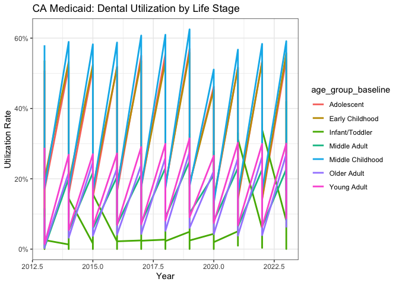
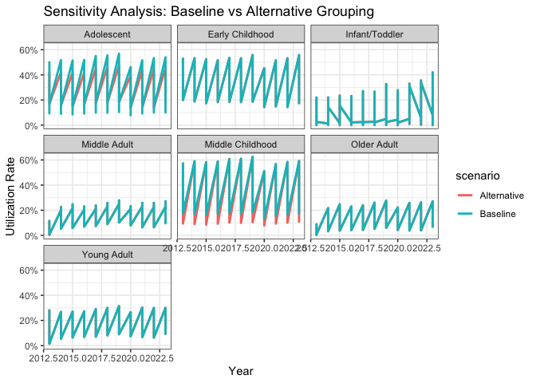
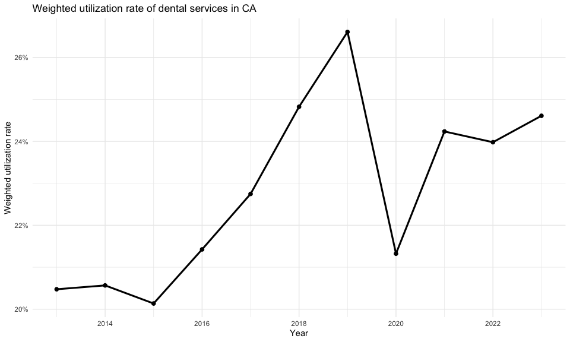
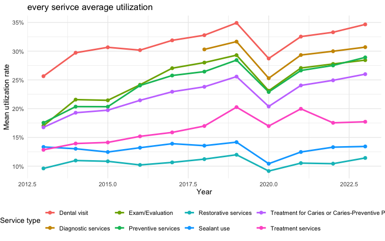
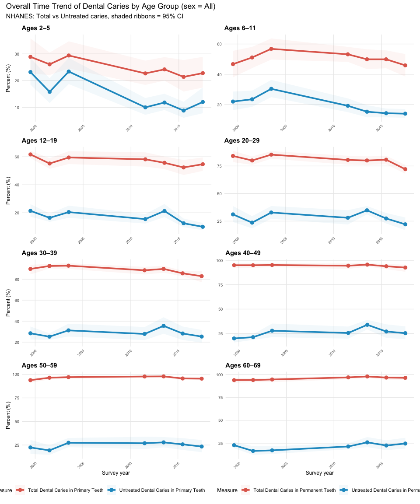
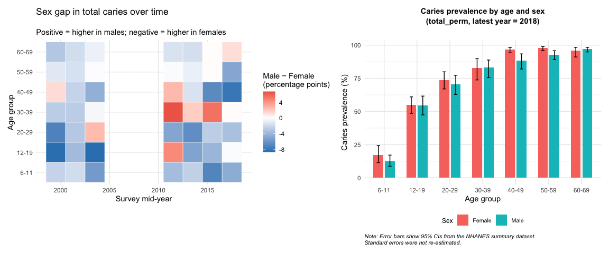
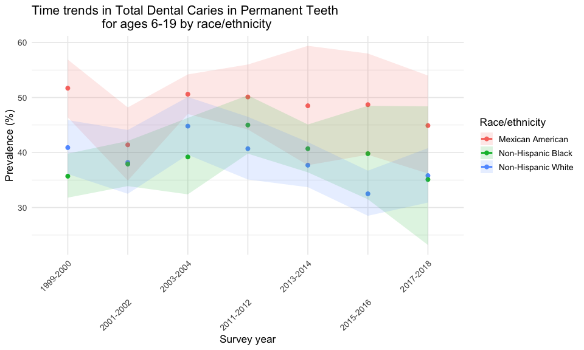
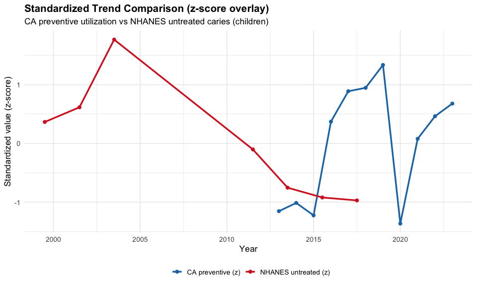
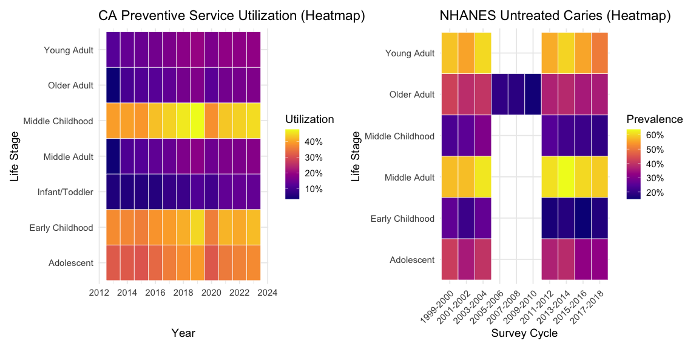
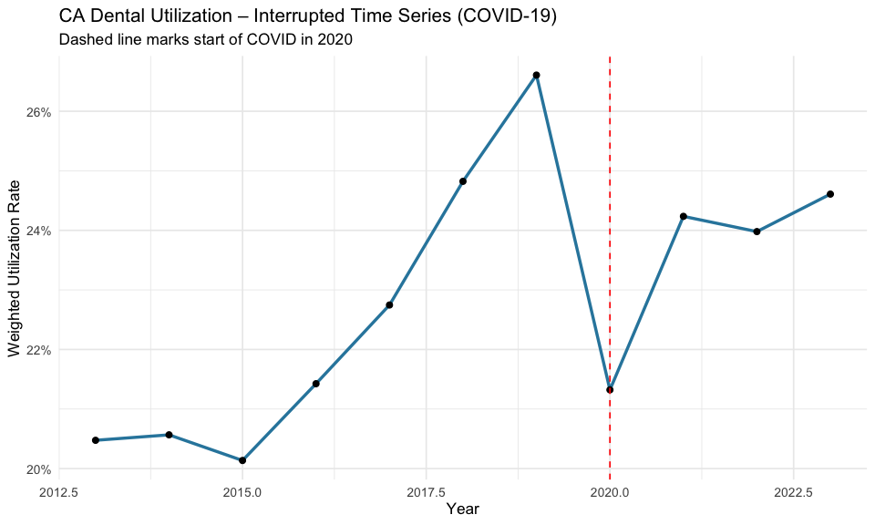

Trends and Regional Differences in U.S. Dental Caries Burden and
Preventive Service Utilization
================
Jian Gao-jg5037
2025-12-05

- [(1) Motivation](#1-motivation)
- [(2) Background & Related Work](#2-background--related-work)
- [(3) Initial Questions](#3-initial-questions)
- [(4) Data Sources](#4-data-sources)
  - [4.1 California Medi-Cal Dental Utilization
    (2013–2023)](#41-california-medi-cal-dental-utilization-20132023)
  - [4.2 NHANES Oral Health Prevalence Estimates
    (1999–2018)](#42-nhanes-oral-health-prevalence-estimates-19992018)
  - [4.3 Data Cleaning](#43-data-cleaning)
- [(5) Exploratory Analysis](#5-exploratory-analysis)
  - [5.1 California statewide utilization trends
    (2013–2023)](#51-california-statewide-utilization-trends-20132023)
  - [5.2 Age-group disparities in
    utilization](#52-age-group-disparities-in-utilization)
  - [5.3 Trends by service type](#53-trends-by-service-type)
  - [5.4 Interrupted Time-Series (ITS) analysis of the COVID-19
    impact](#54-interrupted-time-series-its-analysis-of-the-covid-19-impact)
  - [5.5 National oral health trends from
    NHANES](#55-national-oral-health-trends-from-nhanes)
- [(6) Comparison: California vs
  NHANES](#6-comparison-california-vs-nhanes)
  - [6.1 Alignment between CA utilization trends and national caries
    burden](#61-alignment-between-ca-utilization-trends-and-national-caries-burden)
  - [6.2 Age patterns: high utilization in children vs high disease
    burden in
    youth](#62-age-patterns-high-utilization-in-children-vs-high-disease-burden-in-youth)
  - [6.3 COVID-19 impacts: similar national and state-level
    disruptions](#63-covid-19-impacts-similar-national-and-state-level-disruptions)
  - [6.4 Integrated Interpretation of Disparities and Trend
    Dynamics](#64-integrated-interpretation-of-disparities-and-trend-dynamics)
- [(7) Discussion](#7-discussion)
- [(8) Limitations](#8-limitations)
- [(9) Conclusion](#9-conclusion)
- [References](#references)

# (1) Motivation

Dental service utilization is a key indicator of population oral health
and access to care. Understanding long-term patterns in utilization
helps identify disparities across age groups, service types, and
geographic areas.

California Medi-Cal administrative records provide an opportunity to
examine system-level trends over time, while national NHANES oral health
estimates offer broader context on disease burden and prevention gaps.

Our project integrates these two data sources to understand:

- How has dental service use changed over time in California?
- How do these trends compare to national oral health patterns?

# (2) Background & Related Work

Prior research documents persistent disparities in oral health across
age, socioeconomic status, and race/ethnicity. National surveillance
summaries show long-standing gaps in untreated caries prevalence and
access to preventive services (National Institute of Dental and
Craniofacial Research, 2022).

Preventive interventions—especially dental sealants—are well established
as effective strategies for reducing childhood caries risk and remain a
core component of pediatric oral health policy (Ng et al., 2023).

These studies motivate our investigation by highlighting the importance
of preventive care and the need to understand how service utilization
evolves across different populations.

# (3) Initial Questions

Our project began with the following questions:

1.  **Overall trends**

    - How has overall dental service utilization in California changed
      from 2013 to 2023?
    - Has utilization increased, decreased, or remained stable?

2.  **Age-based disparities**

    - Do age-based disparities exist, and have they widened or narrowed
      over time?
    - Are certain age groups consistently under-utilizing services?

3.  **Service categories**

    - How do different service categories (preventive, diagnostic,
      restorative, sealants, treatment) vary in their trends over time?

4.  **COVID-19 impact**

    - Did COVID-19 cause measurable disruptions in utilization patterns?
    - We explored this using an interrupted time-series (ITS) framework.

5.  **National comparison**

    - How do California trends relate to national oral health data from
      NHANES?
    - Are patterns in preventive service use aligned with trends in
      untreated caries?

# (4) Data Sources

## 4.1 California Medi-Cal Dental Utilization (2013–2023)

- **Source:** California Department of Health Care Services  
- **Contains:** Annual counts of users, denominators, and utilization
  rates across age groups and service categories  
- **Citation:** California Department of Health Care Services (2023)

## 4.2 NHANES Oral Health Prevalence Estimates (1999–2018)

- **Source:** Centers for Disease Control and Prevention  
- **Contains:** Age-, sex-, and race-specific prevalence of total caries
  and untreated caries  
- **Citation:** Centers for Disease Control and Prevention (2025)

## 4.3 Data Cleaning

### CA_datasets were cleaned and processed using the following R code:

``` r
# Load required packages
library(tidyverse)
library(janitor)
library(knitr)
library(here)
setwd("..")

# Read raw data
raw_data <- read_csv("datasets/ca_dental.csv")

# Define age group order for proper sorting
age_order <- c(
  "Age <1","Age 1–2","Age 3–5","Age 6–9",
  "Age 10–14","Age 15–18","Age 19–20","Age 21–34",
  "Age 35–44","Age 45–64","Age 65–74","Age 75+"
)

# Clean dataset: standardize names, remove invalid rows, clean text
clean_data_basic <- raw_data |>
  clean_names() |>  # Standardize column names
  
  mutate(desc_clean = str_to_lower(str_squish(users_annotation_description))) |> 
  filter(
    is.na(desc_clean) |
      !desc_clean %in% c(
        "no data available",
        "cell suppressed for small numbers",
        "cell suppressed for complementary cell"
      )
  ) |>
  select(-desc_clean) |> 
  
  mutate(
    measure = measure |>
      str_replace_all("[–—∼']", "-") |>
      str_remove_all("\\s*\$begin:math:text$[^()]*\\$end:math:text$") |>
      str_squish()
  ) |> 
  
  rename(
    year      = calendar_year,
    age_group = age_filter,
    denominator = denominator_3_months_continuous_eligibility
  ) |> 
  
  mutate(
    age_group = age_group |>
      str_replace_all("[–—∼'-]", "–") |>
      str_squish() |>
      str_replace_all("^Age\\s*<\\s*1$", "Age <1") |>
      str_replace_all("^Age 1–2$|^Age 1-2$", "Age 1–2") |>
      str_replace_all("^Age 3–5$|^Age 3-5$", "Age 3–5") |>
      str_replace_all("^Age 6–9$|^Age 6-9$", "Age 6–9") |>
      str_replace_all("^Age 10–14$|^Age 10-14$", "Age 10–14") |>
      str_replace_all("^Age 15–18$|^Age 15-18$", "Age 15–18") |>
      str_replace_all("^Age 19–20$|^Age 19-20$", "Age 19–20") |>
      str_replace_all("^Age 21–34$|^Age 21-34$", "Age 21–34") |>
      str_replace_all("^Age 35–44$|^Age 35-44$", "Age 35–44") |>
      str_replace_all("^Age 45–64$|^Age 45-64$", "Age 45–64") |>
      str_replace_all("^Age 65–74$|^Age 65-74$", "Age 65–74") |>
      str_replace_all("^Age 75\\+$", "Age 75+"),
    age_group = factor(age_group, levels = age_order)
  ) |> 
  
  arrange(year, age_group, measure)

# Simplify measure names
clean_data_simple <- clean_data_basic |>
  mutate(
    measure = case_when(
      measure == "Annual Dental Visit" ~ "Dental visit",
      measure == "Exams/Oral Health Evaluations" ~ "Exam/Evaluation",
      measure == "Treatment for Caries or Caries–Preventive Procedure" ~ "Caries treatment",
      measure == "Use of Dental Treatment Services" ~ "Treatment services",
      measure == "Use of Diagnostic Services" ~ "Diagnostic services",
      measure == "Use of Preventive Services" ~ "Preventive services",
      measure == "Use of Restorative Services" ~ "Restorative services",
      measure == "Use of Sealant" ~ "Sealant use",
      TRUE ~ measure
    )
  )

# Keep only key variables and rename utilization column
clean_data_final <- clean_data_simple |>
  select(
    year,
    age_group,
    measure,
    users,
    denominator,
    utilization_percent
  ) |>
  rename(
    utilization_rate = utilization_percent
  )

# Save cleaned dataset
write_csv(clean_data_final, here("datasets", "clean_ca.csv"))
```

### NHANES datasets were cleaned and processed using the following R code:

``` r
library(tidyverse)
library(readr)

# Load the data
nhanes <- read_csv("datasets/nhanes_oral.csv")

# Delete useless columns (presentation standards and notes)
cols_to_drop <- c("Presentation Standard", "Note1", "Note2", "Notea", "Noteb")
nhanes <- nhanes %>%
  select(-any_of(cols_to_drop))

# Rename columns to standardized lowercase format
nhanes <- nhanes %>%
  rename(
    survey_years = `Survey Years`,
    sex = Sex,
    age_group = `Age Group`,
    race_ethnicity = `Race and Hispanic Origin`,
    measure = Measure,
    percent = Percent,
    se = `Standard Error`,
    ci_lower = `Lower 95% CI Limit`,
    ci_upper = `Upper 95% CI Limit`
  )

# Clean percent values: remove "%" symbol and convert to numeric
nhanes <- nhanes %>%
  mutate(
    percent = str_replace_all(as.character(percent), "%", ""),
    percent = as.numeric(percent)
  )

# Clean years and create mid-year variable for trend analysis
# Example: "1999–2000" becomes year_mid = 1999.5
nhanes <- nhanes %>%
  mutate(
    survey_years = str_replace_all(survey_years, "–", "-"),
    year_mid = as.numeric(str_sub(survey_years, 1, 4)) + 0.5
  )

# Standardize measure names with short codes
measure_map <- c(
  "Total Dental Caries in Primary Teeth" = "total_primary",
  "Total Dental Caries in Permanent Teeth" = "total_perm",
  "Untreated Dental Caries in Primary Teeth" = "untreated_primary",
  "Untreated Dental Caries in Permanent Teeth" = "untreated_perm",
  "Sealants on Permanent Teeth" = "sealant_perm",
  "Sealants on Permanent and Primary Teeth" = "sealant_all"
)

nhanes <- nhanes %>%
  mutate(measure_clean = recode(measure, !!!measure_map))

# Filter to specific age groups (exclude broad/aggregate groups)
nhanes <- nhanes %>%
  filter(age_group %in% c(
    "2-5", "6-11", "12-19",
    "20-29", "30-39", "40-49", "50-59",
    "60-69", "70 and over"
  ))

# Remove rows with missing percent values
nhanes_clean <- nhanes %>%
  filter(!is.na(percent))

# Select and order final variables
nhanes_clean <- nhanes_clean %>%
  select(
    survey_years, year_mid, sex, age_group,
    race_ethnicity, measure, measure_clean,
    percent, se, ci_lower, ci_upper
  )

# Save cleaned dataset
write_csv(nhanes_clean, "datasets/nhanes_oral_clean.csv")
```

### sensitivity analysis code for age group definitions

``` r
library(dplyr)
library(stringr)
library(readr)
library(tidyr)
library(ggplot2)
library(scales)

ca_data <- read.csv("~/Desktop/P8105_final_project/datasets/clean_ca.csv") %>%
  mutate(
    age_group_std = str_replace_all(age_group, "–", "-"),
    age_group_baseline = case_when(
      age_group_std %in% c("Age <1","Age 1-2") ~ "Infant/Toddler",
      age_group_std == "Age 3-5" ~ "Early Childhood",
      age_group_std == "Age 6-9" ~ "Middle Childhood",
      age_group_std %in% c("Age 10-14","Age 15-18") ~ "Adolescent",
      age_group_std %in% c("Age 19-20","Age 21-34") ~ "Young Adult",
      age_group_std %in% c("Age 35-44","Age 45-64") ~ "Middle Adult",
      age_group_std %in% c("Age 65-74","Age 75+") ~ "Older Adult"
    ),
    age_group_alt = case_when(
      age_group_std %in% c("Age <1","Age 1-2") ~ "Infant/Toddler",
      age_group_std == "Age 3-5" ~ "Early Childhood",
      age_group_std %in% c("Age 6-9","Age 10-14") ~ "Middle Childhood",
      age_group_std == "Age 15-18" ~ "Adolescent",
      age_group_std %in% c("Age 19-20","Age 21-34") ~ "Young Adult",
      age_group_std %in% c("Age 35-44","Age 45-64") ~ "Middle Adult",
      age_group_std %in% c("Age 65-74","Age 75+") ~ "Older Adult"
    ),
    year_num = as.numeric(str_replace(year, "CY ", "")),
    util_rate_num = parse_number(utilization_rate) / 100
  )

p_main <- ggplot(ca_data, aes(year_num, util_rate_num, color = age_group_baseline)) +
  geom_line(size = 1) +
  scale_y_continuous(labels = percent_format()) +
  labs(title = "CA Medicaid: Dental Utilization by Life Stage",
       x = "Year", y = "Utilization Rate") +
  theme_bw()

sens_data <- bind_rows(
  ca_data %>% transmute(year_num, util_rate_num,
                        age_group = age_group_baseline,
                        scenario = "Baseline"),
  ca_data %>% transmute(year_num, util_rate_num,
                        age_group = age_group_alt,
                        scenario = "Alternative")
)

p_sens <- ggplot(sens_data, aes(year_num, util_rate_num, color = scenario)) +
  geom_line(size = 1) +
  facet_wrap(~ age_group) +
  scale_y_continuous(labels = percent_format()) +
  labs(title = "Sensitivity Analysis: Baseline vs Alternative Grouping",
       x = "Year", y = "Utilization Rate") +
  theme_bw()

sens_summary <- sens_data %>%
  group_by(age_group, scenario) %>%
  summarise(mean_rate = mean(util_rate_num), .groups = "drop") %>%
  pivot_wider(names_from = scenario, values_from = mean_rate) %>%
  mutate(diff = Alternative - Baseline)

p_main
```

<!-- -->

``` r
p_sens
```

<!-- -->

``` r
sens_summary
```

    ## # A tibble: 7 × 4
    ##   age_group        Alternative Baseline    diff
    ##   <chr>                  <dbl>    <dbl>   <dbl>
    ## 1 Adolescent            0.329    0.347  -0.0176
    ## 2 Early Childhood       0.396    0.396   0     
    ## 3 Infant/Toddler        0.0947   0.0947  0     
    ## 4 Middle Adult          0.144    0.144   0     
    ## 5 Middle Childhood      0.395    0.427  -0.0321
    ## 6 Older Adult           0.135    0.135   0     
    ## 7 Young Adult           0.169    0.169   0

### Summary

Our project involved two major datasets. Below we summarize the key
steps taken to prepare each dataset for analysis.

**1. California Medi-Cal Dental Utilization Data**

- Standardized variable names and removed annotation rows such as “no
  data available”.

- Cleaned and unified age-group labels (e.g., “Age 10–14”, “Age 35–44”)
  and set ordered factors.

- Harmonized service measure names into readable categories (e.g.,
  Preventive services, Restorative services).

- Selected core variables (year, age_group, measure, users, denominator,
  utilization_rate).

- Saved the final cleaned dataset as `clean_ca.csv`.

**2. NHANES Oral Health Prevalence Data**

- Removed unused metadata columns (presentation standards and notes).

- Renamed variables into standardized lowercase names.

- Cleaned percentage values by removing “%” and converting to numeric.

- Created year_mid variable using survey cycle midpoints for trend
  modeling.

- Recoded long measure labels into concise categories (e.g., total_perm,
  untreated_primary).

- Filtered to analytical NHANES age groups and removed rows with missing
  values.

- Saved cleaned dataset as `nhanes_oral_clean.csv`.

**3. Sensitivity Analysis on Age Group Definitions**

“Sensitivity analysis comparing the baseline and alternative age-group
definitions showed that five of the seven life-stage categories produced
identical utilization estimates. Only Adolescent and Middle Childhood
differed slightly (–1.8% and –3.2% respectively), reflecting the
intentional boundary shift of the 10–14 age segment. These differences
were small and did not change temporal trends or overall conclusions;
therefore, the baseline life-stage grouping was retained for the main
analysis.”

Together, these datasets allow comparison of service use patterns
(California) and disease burden (NHANES) over time.

# (5) Exploratory Analysis

This section summarizes descriptive findings from both the California
administrative dataset (2013–2023) and national NHANES oral health
prevalence data. Together, these analyses illustrate statewide
utilization patterns, disparities by age, variation across service
types, the impact of COVID-19, and how California trends compare to
national disease burden.

## 5.1 California statewide utilization trends (2013–2023)

<!-- -->

Statewide weighted dental service utilization in California shows:

- A gradual increase from 2013 to 2019, reaching a peak of **26.6%**.
- A sharp decline in 2020, consistent with COVID-19 disruptions.
- A steady recovery from 2021 to 2023, with rates stabilizing around
  **24–25%**.

The mean utilization rate was **23%**, and enrollment increased by over
**111%**.

## 5.2 Age-group disparities in utilization

<!-- -->

Across all years, utilization rates vary substantially by age:

- Children (ages \<10) consistently exhibit the highest utilization of
  preventive and diagnostic services.
- Adults (30–59) show moderate but stable patterns, with slight declines
  during COVID-19.
- Older adults (≥65) show the lowest but steadily increasing
  utilization, reflecting improving access.

Time-series plots reveal persistent age gradients, with younger groups
accessing services more frequently than adults.

## 5.3 Trends by service type

<!-- -->
Eight service categories were evaluated from 2013–2023:

- **Dental visits** showed the highest utilization and a consistent
  upward trend (from ~25.6% to ~34.9%).
- **Preventive services** and **Exam/Evaluation** also increased
  steadily, reaching nearly **30%** by 2023.
- **Restorative** and **Diagnostic** services remained low (~10–12%) but
  stable.
- **Sealant** use fluctuated but generally increased prior to COVID-19.
- Nearly all categories show a 2020 decline, followed by recovery.

These patterns suggest sustained improvements in preventive care access
over the decade.

## 5.4 Interrupted Time-Series (ITS) analysis of the COVID-19 impact

| term |  slope |  p_value |
|:-----|-------:|---------:|
| year | 0.0061 | 0.000137 |

linear model results for year trend

| r.squared | adj.r.squared |       AIC |      BIC |
|----------:|--------------:|----------:|---------:|
|    0.1873 |        0.1798 | -882.5686 | -834.815 |

model summary statistics

An ITS model was used to estimate the effect of COVID-19 on statewide
utilization:

The long-term regression model reveals a clear and statistically
significant upward trajectory in statewide dental service utilization
prior to the COVID-19 pandemic. The estimated yearly slope of **+0.0061
(p \< 0.001)** indicates steady, sustained growth in utilization leading
up to 2020—reflecting expanding engagement with Medi-Cal dental
services.

When viewed alongside the observed data, this strong pre-pandemic upward
trend highlights the magnitude of the disruption that occurred during
COVID-19. Despite the long-term growth pattern captured by the model,
statewide utilization dropped sharply in 2020, breaking from the
established trajectory. Although the model does not explicitly estimate
a COVID-specific coefficient, the divergence between the predicted trend
and the actual 2020 outcomes underscores a substantial pandemic-related
shock to in-person dental care access.

Model fit measures **(R² ≈ 0.18, AIC ≈ –882)** indicate that the model
reasonably captures long-term dynamics, reinforcing the interpretation
that COVID-19 represents a pronounced deviation from an otherwise
consistent upward trend.

## 5.5 National oral health trends from NHANES

To contextualize California utilization patterns, national NHANES data
were examined for total and untreated caries in permanent teeth.

### 5.5.1 Trends in total and untreated caries (by age groups)

<!-- -->

The NHANES age-specific trend panels show three consistent national
patterns:

- **Total caries prevalence is high across all age groups**, with only a
  slight decline in recent cycles.

- **Untreated caries decreases more noticeably**, especially among
  adolescents and young adults.

- **Adults exhibit substantially higher total caries levels**, often
  **80–90%**, reflecting cumulative disease burden.

Overall, the national trends highlight **high total caries, gradual
improvement in untreated disease, and strong age gradients**—patterns
that closely resemble California’s age-based disparities.

### 5.5.2 National regression slopes

| dentition | age_group | outcome | slope_per_year | slope_per_10yrs | slope_10yr_lower | slope_10yr_upper | n_cycles | first_year_mid | last_year_mid |
|:---|:---|:---|---:|---:|---:|---:|---:|---:|---:|
| Permanent | 6-11 | Total caries | -0.31 | -3.05 | -6.90 | 0.79 | 7 | 1999.5 | 2017.5 |
| Permanent | 12-19 | Total caries | -0.34 | -3.41 | -7.06 | 0.24 | 7 | 1999.5 | 2017.5 |
| Permanent | 20-29 | Total caries | -0.41 | -4.09 | -9.10 | 0.92 | 7 | 1999.5 | 2017.5 |
| Permanent | 30-39 | Total caries | -0.43 | -4.28 | -7.10 | -1.46 | 7 | 1999.5 | 2017.5 |
| Permanent | 40-49 | Total caries | -0.04 | -0.44 | -1.69 | 0.80 | 7 | 1999.5 | 2017.5 |
| Permanent | 50-59 | Total caries | 0.02 | 0.16 | -1.81 | 2.12 | 7 | 1999.5 | 2017.5 |
| Permanent | 60-69 | Total caries | 0.21 | 2.13 | 0.68 | 3.57 | 7 | 1999.5 | 2017.5 |
| Permanent | 6-11 | Untreated caries | -0.22 | -2.22 | -4.35 | -0.09 | 7 | 1999.5 | 2017.5 |
| Permanent | 12-19 | Untreated caries | -0.45 | -4.53 | -9.03 | -0.02 | 7 | 1999.5 | 2017.5 |
| Permanent | 20-29 | Untreated caries | -0.04 | -0.38 | -8.83 | 8.08 | 7 | 1999.5 | 2017.5 |
| Permanent | 30-39 | Untreated caries | 0.10 | 1.05 | -3.84 | 5.94 | 7 | 1999.5 | 2017.5 |
| Permanent | 40-49 | Untreated caries | 0.54 | 5.38 | 0.20 | 10.55 | 7 | 1999.5 | 2017.5 |
| Permanent | 50-59 | Untreated caries | 0.21 | 2.10 | -2.88 | 7.08 | 7 | 1999.5 | 2017.5 |
| Permanent | 60-69 | Untreated caries | 0.23 | 2.29 | -2.32 | 6.90 | 7 | 1999.5 | 2017.5 |
| Primary | 2-5 | Total caries | -0.35 | -3.53 | -6.13 | -0.93 | 7 | 1999.5 | 2017.5 |
| Primary | 6-11 | Total caries | -0.17 | -1.69 | -7.38 | 4.00 | 7 | 1999.5 | 2017.5 |
| Primary | 2-5 | Untreated caries | -0.73 | -7.28 | -12.44 | -2.12 | 7 | 1999.5 | 2017.5 |
| Primary | 6-11 | Untreated caries | -0.70 | -7.01 | -11.39 | -2.63 | 7 | 1999.5 | 2017.5 |

Estimated linear time trends (slopes) in caries prevalence by dentition,
age group, and outcome. Slopes are interpreted as percentage-point
change per 10 years.

NHANES slope estimates show that:

- **Total caries** decline slightly for most younger age groups (e.g.,
  −0.31 to −0.43 per year for ages 6–39), indicating gradual
  improvement. Older adults (50–69) show **flat or slightly increasing**
  trends (0.02 to 0.21).

- **Untreated caries** decline more sharply, especially among **children
  and adolescents** (e.g., −0.22 for ages 6–11 and −0.45 for ages
  12–19), while some adult groups (30–49) show **small positive
  slopes**, suggesting gaps in timely care.

- **Primary-teeth caries** in young children show substantial declines
  (e.g., −0.35 to −0.73 per year for ages 2–5 and 6–11).

Overall, these patterns indicate slow national improvement, driven
mainly by reductions in untreated disease among younger populations.

### 5.5.3 Sex differences in caries prevalence

<!-- -->

Sex differences in caries prevalence

The combined heat map and bar chart indicate that sex differences in
dental caries prevalence are **modest and inconsistent** across NHANES
cycles:

- The heat map shows **small male–female gaps**, typically within **±8
  percentage points**, with the direction of the gap varying by survey
  cycle and age group.

- No age group exhibits a persistent advantage; in some cycles males
  have slightly higher prevalence, while in others females do.

- In the most recent NHANES cycle (bar chart), females and males show
  nearly identical prevalence across all age groups, with minimal
  separation in confidence intervals.

**Overall, sex disparities in caries prevalence are present but small,
non-systematic, and not clinically dominant compared with age or
race/ethnicity differences.**

### 5.5.4 Race/ethnicity disparities

<!-- -->

NHANES data show persistent race/ethnicity disparities in caries
prevalence among children ages 6–19:

- **Mexican American children consistently exhibit the highest
  prevalence**, remaining around **50–60%** across most survey cycles.

- **Non-Hispanic Black children show intermediate prevalence**,
  generally higher than Non-Hispanic White children.

- **Non-Hispanic White children consistently have the lowest
  prevalence**, typically **10–15 percentage points lower** than Mexican
  American children.

- These differences appear across all survey years, with **modest
  narrowing in some cycles but clear and persistent gaps overall**.

These findings align with national reports documenting long-standing
disparities in oral health outcomes and unequal access to preventive
dental services.

### 5.5.5 Summary of national context

NHANES findings collectively show:

- **Persistent high national prevalence of dental caries**, especially
  among adolescents and adults.

- **Declining trends in untreated caries**, with the clearest
  improvements seen in adolescents and young adults.

- **Strong age gradients**, as prevalence rises sharply from childhood
  to older adulthood.

- **Moderate sex differences**, with male–female gaps fluctuating across
  cycles but remaining relatively small.

- **Consistent racial/ethnic disparities**, with Mexican American and
  Non-Hispanic Black children showing higher total caries prevalence
  than Non-Hispanic White children.

These national patterns provide an essential benchmark for interpreting
California’s utilization results, highlighting both the underlying
burden of oral disease and the structural inequities that shape access
and outcomes.

# (6) Comparison: California vs NHANES

This section synthesizes findings from California’s administrative
utilization data and NHANES national oral health prevalence data.
Together, they help assess whether California’s service utilization
patterns are aligned with national disease burden and preventive care
needs.

## 6.1 Alignment between CA utilization trends and national caries burden

<!-- -->

- **California preventive utilization shows a clear upward trajectory**,
  especially after 2013, indicating increasing access to or uptake of
  preventive dental services.

- **NHANES untreated caries trends move in the opposite direction**,
  showing a steady decline from 1999 to 2018, most prominently among
  children and adolescents.

- The **inverse patterns**—rising preventive utilization in California
  and falling untreated disease nationally—suggest that expanded
  preventive care may correspond with lower caries burden at the
  population level.

- Although the datasets cover different populations and non-overlapping
  years, the **directionality of the trends is consistent**: prevention
  increases while untreated disease decreases, supporting potential
  alignment between service delivery and disease reduction goals.

## 6.2 Age patterns: high utilization in children vs high disease burden in youth

<!-- -->

- **California heatmap** shows that preventive service utilization is
  **highest in children**, especially in

- **Early Childhood (ages 3–5)** and **Middle Childhood (ages 6–9)**,
  with consistently elevated use through **Adolescence**.Utilization
  declines sharply moving into **Young Adult**, **Middle Adult**, and
  **Older Adult** stages.

- **NHANES heatmap** shows that **untreated caries prevalence is highest
  among adolescents and young adults**, with notable burdens in
  **Adolescence (12–19) and Middle Adult** groups. Younger children show
  lower untreated prevalence, while older adults exhibit mixed but
  moderate levels.

**Together**, these patterns indicate that California directs more
preventive and diagnostic dental services toward life stages with
**lower national untreated disease burden**, while NHANES highlights
much higher burden in adolescents and young adults. This suggests that
**service utilization in California may be disproportionately
concentrated in younger children**, whereas **national need is highest
in adolescents**, pointing to potential opportunities to rebalance
preventive resources.

## 6.3 COVID-19 impacts: similar national and state-level disruptions

    ## # A tibble: 4 × 5
    ##   term                estimate std.error statistic   p.value
    ##   <chr>                  <dbl>     <dbl>     <dbl>     <dbl>
    ## 1 (Intercept)       -28.0        6.83      -4.10   0.0000446
    ## 2 year                0.0140     0.00339    4.13   0.0000391
    ## 3 covid_period        0.825     16.9        0.0488 0.961    
    ## 4 year:covid_period  -0.000434   0.00837   -0.0518 0.959

<!-- -->
We estimate the following model:

$$\text{utilization}_{t}
= \beta_0
+ \beta_1 \cdot year_t
+ \beta_2 \cdot covid_t
+ \beta_3 \cdot (year_t \times covid_t)$$

Both datasets show clear signs of COVID-19–related disruption, although
the magnitude and timing differ:

- **California’s utilization experienced an abrupt decline in 2020**,
  visible in the interrupted time-series plot.The ITS model confirms **a
  strong pre-COVID upward trend (β₁ ≈ 0.014, p \< 0.001)**, but **no
  statistically significant level or slope change** at the onset of
  COVID (β₂, β₃ not significant), reflecting a **sharp but temporary
  dip** rather than a long-term shift.

- **NHANES data (collected before the 2020 lockdowns)** already showed
  flattening or slowing improvements in **untreated caries** during
  2015–2018, indicating a **disruption-like pattern even before the
  pandemic**, consistent with broader national service reductions and
  access barriers.

Taken together, the two datasets indicate that **COVID-19 produced
noticeable but short-lived service disruptions in California**, while
**NHANES shows pre-pandemic stagnation in disease improvements**,
suggesting that **national oral health systems were already vulnerable
to shocks** that became more visible during the pandemic.

## 6.4 Integrated Interpretation of Disparities and Trend Dynamics

Across prior analyses, California utilization patterns and NHANES
disease metrics reveal several converging themes regarding disparities,
trend direction, and population-level alignment with national oral
health needs.

**Age disparities**

California consistently shows the highest preventive service use among
young children, whereas NHANES indicates the greatest untreated caries
burden among adolescents and adults. This divergence suggests that
California’s utilization patterns prioritize early-life preventive care,
while national disease burden remains concentrated in older youth and
adults

**Sex disparities**

NHANES visualizations demonstrated small but persistent male–female
differences in caries burden, with no consistent directional advantage.
Although California lacks sex-specific utilization data, the modest
national gaps imply limited sex-based inequity in the corresponding
service context.

**Race/ethnicity disparities**

NHANES exhibits pronounced and persistent disparities, particularly
among Mexican American and Non-Hispanic Black youth. The absence of
race/ethnicity identifiers in California’s administrative data prevents
equity-focused comparisons and represents a structural limitation for
state-level monitoring.

**Trend direction and intensity**

NHANES exhibits pronounced and persistent disparities, particularly
among Mexican American and Non-Hispanic Black youth. The absence of
race/ethnicity identifiers in California’s administrative data prevents
equity-focused comparisons and represents a structural limitation for
state-level monitoring.

**Overall synthesis**

Integrated with earlier trend plots, ITS estimates, and demographic
heatmaps, the evidence suggests that California’s dental utilization
system is broadly aligned with national prevention goals, characterized
by strong emphasis on early-life preventive care and resilient
post-COVID recovery. However, critical equity gaps—particularly the
absence of race/ethnicity data—limit the state’s ability to assess
whether service improvements are equitably distributed across
populations.

# (7) Discussion

Our analysis provides a comprehensive view of dental service utilization
patterns in California (2013–2023) and situates these findings within
the broader context of national oral health trends reported by NHANES.
Several key themes emerge:

1.  **Long-term improvements alongside persistent disparities**

    - California shows a clear upward trend in preventive and overall
      dental service utilization, suggesting expanded access and growing
      engagement with preventive care. This aligns with national
      declines in untreated caries observed in NHANES, particularly
      among children and adolescents.
    - However, disparities remain substantial. Utilization varies
      sharply across age groups, with young children demonstrating the
      highest engagement and older adults much lower rates.
    - NHANES reveals complementary disparities: adolescents and older
      adults carry a disproportionate caries burden, and racial/ethnic
      gaps remain evident.

2.  **COVID-19 introduced measurable disruptions**

    - California shows a pronounced drop in 2020 utilization across
      nearly all service categories, followed by gradual recovery.
    - NHANES does not include 2020, but temporal patterns before
      2015–2018 indicate instability and slower declines in untreated
      caries, consistent with limited access during the pandemic.

3.  **Service-type patterns highlight preventive demand but uneven use**

    - Preventive, exam/evaluation, and dental visit services show the
      strongest, most consistent growth.
    - Restorative and sealant services remain used at far lower levels.
    - Age-specific utilization heatmaps reveal that high-use service
      categories are concentrated among children, while
      adults—especially older adults—engage primarily in restorative
      treatment rather than preventive care.

4.  **Trends suggest alignment between utilization and disease burden**

    - Groups with higher disease burden nationally (e.g., school-aged
      children, adolescents, older adults) correspond to the groups
      where California’s utilization patterns show either high
      engagement (younger children) or persistent under-engagement
      (older adults).
    - The parallel between rising preventive utilization in California
      and declining untreated caries nationally suggests that preventive
      strategies remain central to population-level improvements in oral
      health, though adult preventive utilization remains a key gap.

5.  **Implications for policy and practice**

    - Successful expansion of preventive dental access for children,
      consistent with national goals.
    - Ongoing gaps for adolescents and older adults, both in utilization
      and disease burden.
    - Need for recovery planning post-COVID, especially for vulnerable
      age groups.
    - Importance of preventive interventions such as sealants, whose low
      utilization contrasts with their documented effectiveness (Ng et
      al., 2023).

These patterns underscore the need for age-tailored strategies and
potentially enhanced coverage or outreach programs to reduce disparities
and sustain long-term improvements.

# (8) Limitations

Several limitations should be considered when interpreting the findings
from this project. These limitations arise from both the structure of
the datasets used and the analytic constraints associated with
aggregated data.

1.  **Use of aggregated administrative data in California**

    - The California dataset is fully aggregated at the year × age group
      × service type level.
    - Individual-level variation cannot be analyzed; behavioral
      predictors and standard statistical adjustments are not available.
    - Equity analyses are limited because race/ethnicity and sex
      variables are not available.

    Observed patterns therefore reflect population averages and may mask
    within-group disparities.

2.  **Limited time-series resolution and ITS model power**

    - The ITS analysis uses annual data, reducing sensitivity to rapid
      changes.
    - Only one data point represents the COVID-19 disruption year
      (2020).
    - The short series (11 years) limits power to detect slope changes
      or interaction effects.

    COVID-related effects may be underestimated or imprecisely measured.

3.  **NHANES summary tables restrict analytic flexibility**

    - NHANES data were used in pre-aggregated form, which prevents
      reapplying survey weights, conducting hypothesis tests, or
      adjusting for covariates.
    - Summary tables only include selected age groups, limiting full
      life-course comparability.

4.  **Temporal misalignment between datasets**

    - California utilization spans 2013–2023.
    - NHANES spans 1999–2018.

    Trends cannot be aligned year-by-year, and COVID-19 effects cannot
    be examined in NHANES. Comparisons rely on pattern similarity rather
    than direct temporal correspondence.

5.  **Utilization does not equate to disease burden**

    - California data measure service use, not oral health outcomes.
    - NHANES measures caries prevalence, not utilization or access.

    High utilization does not necessarily imply improved oral health;
    low disease burden does not necessarily imply adequate access.
    Interpretations linking utilization and disease burden must
    therefore be made cautiously.

# (9) Conclusion

This project examined statewide dental service utilization patterns in
California from 2013 to 2023 and compared these trends with national
oral health indicators from NHANES. Our findings highlight both
meaningful progress and persistent challenges in achieving equitable
access to dental care.

- California demonstrated steady long-term increases in overall and
  preventive utilization, particularly among children. Preventive and
  diagnostic services drove much of this growth, suggesting improvements
  in early detection and routine care.
- Despite the pronounced drop in utilization during the COVID-19
  pandemic, recovery patterns indicate a return toward the pre-existing
  upward trajectory.
- Substantial disparities remain: infants and older adults consistently
  have the lowest engagement with dental services, while young children
  exhibit the highest utilization.
- NHANES data reveal elevated caries burden in adolescents and adults
  and persistent racial and ethnic disparities, gaps that cannot be
  directly evaluated in the California dataset due to missing
  demographic information.

The comparison of utilization and disease burden suggests that
improvements in preventive service use may be contributing to broader
positive trends in oral health, although the relationship cannot be
assessed causally with the available data. Nevertheless, the findings
support the conclusion that California’s dental system has expanded
access to preventive care in a manner consistent with national oral
health needs.

Continued progress will require:

- Sustained investment in preventive services,  
- Focused efforts to reach underserved age groups, and  
- More comprehensive data collection to evaluate disparities in greater
  depth.

These results provide a foundation for future work aimed at
understanding patterns of care, addressing inequities, and improving
population oral health outcomes.

# References

California Department of Health Care Services. (2023). *Dental
utilization measures and sealant data by age groups, calendar year
2013–2023*. data.gov.
<https://catalog.data.gov/dataset/dental-utilization-measures-and-sealant-data-by-age-groups-calendar-year-2013-to-2021-61ecf>

Centers for Disease Control and Prevention. (2025). *NHANES: Select oral
health prevalence estimates*. healthdata.gov.
<https://healthdata.gov/CDC/NHANES-Select-Oral-Health-Prevalence-Estimates/xif4-xkww/about_data>

National Institute of Dental and Craniofacial Research. (2022). *Oral
Health in America: Advances and Challenges — Section 2 summary*. NIDCR,
NIH.
<https://www.nidcr.nih.gov/research/oralhealthinamerica/section-2-summary>

Ng, T. C. H., et al. (2023). A concise review of dental sealants in
caries management. *PMC Open Review*.
<https://pmc.ncbi.nlm.nih.gov/articles/PMC10149715/>
